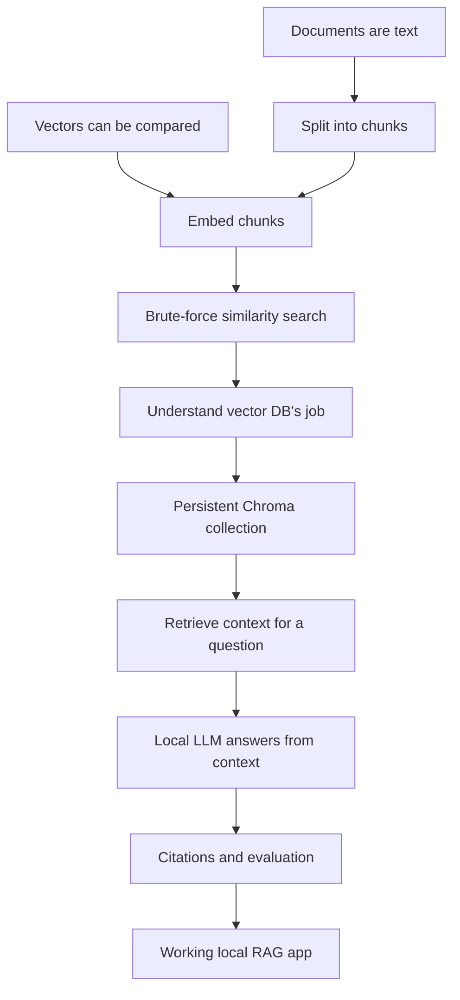

> [!quote] YOU

> [!note] SKILL loaded: teach

Help me learn more about RAG. I want to learn how to set it up from scratch. But I am not that great with vector dbs


> [!question] Quiz
> In a basic RAG system, what is the retriever primarily responsible for?
>
> Choose the best description.
>
> 1. Finding relevant source passages for a user question
> 2. Converting source passages into database tables
> 3. Training the language model on the source documents
> 4. Writing the final answer from the user question


> [!success] Quiz — correct ✓
> Your answer: 1. Finding relevant source passages for a user question
> Correct answer: 1
>
> The retriever finds relevant passages from the knowledge source. A generator—usually an LLM—then uses those passages and the question to produce the answer.


> [!question] Quiz
> Suppose two text chunks have similar meanings but use different words. What is the main reason embedding-based search can still match them?
>
> 1. The chunks are always assigned the same keyword
> 2. Their database rows must have identical text
> 3. The language model rewrites every chunk during lookup
> 4. Their vectors can be close in the embedding space


> [!warning] Quiz — cancelled
> (user skipped)


> [!quote] YOU

Help me learn more about RAG. I want to learn how to set it up from
 scratch. But I haven't worked with vector databases before.


> [!question] Question
> What would “set up RAG from scratch” ideally mean by the end?
>
> 1. Build a small working RAG app locally (Recommended)
> 2. Understand the architecture first
> 3. Build a production-oriented service


> [!example] Answer
> 1. Build a small working RAG app locally (Recommended)


> [!question] Quiz
> Suppose you have 10,000 text passages and a user's question. What is the main job of retrieval in a RAG system?
>
> 1. Verify that the model’s final answer is factually correct
> 2. Find passages likely to contain relevant information
> 3. Rewrite every passage into a shorter summary
> 4. Train the language model on all stored passages


> [!success] Quiz — correct ✓
> Your answer: 2. Find passages likely to contain relevant information
> Correct answer: 2
>
> Retrieval selects a small set of passages likely to help answer the question. It does not train the model, summarize the entire corpus, or guarantee that the generated answer is correct.


> [!question] Quiz
> Why can embedding search often find a relevant passage even when it shares few exact words with the question?
>
> 1. Embeddings expand every query into all possible synonyms
> 2. Embeddings compress each passage without losing any information
> 3. Embeddings place semantically similar text near each other
> 4. Embeddings let the language model inspect every passage at once


> [!success] Quiz — correct ✓
> Your answer: 3. Embeddings place semantically similar text near each other
> Correct answer: 3
>
> An embedding model maps text to vectors so semantically related texts tend to be nearby under a chosen similarity measure. It is not lossless compression, exhaustive synonym expansion, or a way to place the whole corpus in the prompt.


> [!question] Quiz
> A vector database stores one embedding per text chunk. At query time, which operation most directly produces the initial candidate chunks?
>
> 1. Generating a new embedding for every stored chunk
> 2. Clustering all chunk embeddings with the query
> 3. Nearest-neighbor search using the query embedding
> 4. Appending the stored embeddings to the model prompt


> [!success] Quiz — correct ✓
> Your answer: 3. Nearest-neighbor search using the query embedding
> Correct answer: 3
>
> The question is embedded once, then nearest-neighbor search compares that query vector with stored chunk vectors—usually via an index—to return the closest candidates.


> [!question] Quiz
> If embeddings are not normalized, which statement about cosine similarity and dot-product ranking is correct?
>
> 1. They become equivalent whenever vectors have the same dimension
> 2. They differ only when the database uses approximate search
> 3. They can rank results differently because vector magnitude affects dot product
> 4. They always rank results identically because both measure vector direction


> [!success] Quiz — correct ✓
> Your answer: 3. They can rank results differently because vector magnitude affects dot product
> Correct answer: 3
>
> Cosine similarity divides by both vector magnitudes and therefore compares direction; raw dot product also grows with magnitude. Their rankings are guaranteed to align when vectors are normalized to equal length, not merely when dimensions match.


> [!question] Quiz
> In an HNSW vector index, what is the usual effect of increasing `efSearch` at query time?
>
> 1. Lower recall with faster indexing
> 2. Higher recall with slower queries
> 3. Smaller storage with slower ingestion
> 4. Better embeddings with unchanged latency


> [!question] Quiz — I don't know
> Your answer: I don't know
> Correct answer: 2
>
> `efSearch` controls how broadly HNSW explores candidates during a query. A larger value usually improves recall but costs more query time. It does not change embedding quality or the already-built index.


> [!question] Question
> Which language should we use for the working local app?
>
> 1. Python (Recommended)
> 2. TypeScript


> [!example] Answer
> 1. Python (Recommended)


> [!question] Quiz
> In Python, what does this expression produce: `[embed(x) for x in chunks]`?
>
> 1. A single embedding representing all chunks together
> 2. A list containing one embedding per chunk
> 3. A dictionary mapping chunks to their embeddings
> 4. A generator that embeds chunks only when iterated


> [!success] Quiz — correct ✓
> Your answer: 2. A list containing one embedding per chunk
> Correct answer: 2
>
> Square-bracket comprehension syntax constructs a list eagerly, calling `embed(x)` once for each item in `chunks`.


> [!question] Quiz
> A Python script successfully writes vectors to a local database, but after restarting it, the collection appears empty. Which implementation detail should you inspect first?
>
> 1. Whether generation uses a low temperature value
> 2. Whether the client uses a persistent on-disk path
> 3. Whether the query prompt contains a system message
> 4. Whether chunk embeddings use cosine normalization


> [!success] Quiz — correct ✓
> Your answer: 2. Whether the client uses a persistent on-disk path
> Correct answer: 2
>
> Restart survival depends first on using persistent storage rather than an in-memory client. Prompting, normalization, and temperature affect other parts of the system, not whether data is retained.


> [!question] Quiz
> You change to a different embedding model whose output dimension is 768 instead of 384. What should you generally do with an existing collection of 384-dimensional vectors?
>
> 1. Convert only the user query to 384 dimensions before searching
> 2. Re-embed the chunks and rebuild a compatible collection
> 3. Store both dimensions together in the same vector index
> 4. Pad each old vector with zeros until it has 768 dimensions


> [!success] Quiz — correct ✓
> Your answer: 2. Re-embed the chunks and rebuild a compatible collection
> Correct answer: 2
>
> Stored vectors and query vectors must share an embedding space—not merely a dimension count. Changing models means re-embedding the corpus and using a collection/index configured for the new vectors.


> [!question] Quiz
> You have test questions with a known relevant chunk for each. Which metric directly measures how often that chunk appears anywhere in the top 5 retrieved results?
>
> 1. Precision@5
> 2. Mean reciprocal rank
> 3. Recall@5
> 4. Answer faithfulness


> [!success] Quiz — correct ✓
> Your answer: 3. Recall@5
> Correct answer: 3
>
> Note: I am not sure about this
>
> Recall@5 asks whether the relevant material was recovered within the first five results (or what fraction of all relevant items was recovered). Precision@5 measures the relevant fraction among five results; reciprocal rank cares about the first relevant result’s position; faithfulness evaluates generated answers.


> [!question] Quiz
> For one query, your retriever returns 5 chunks; 2 are relevant. There are 4 relevant chunks in the full corpus. What are Precision@5 and Recall@5?
>
> 1. Precision@5 = 0.5; Recall@5 = 0.4
> 2. Precision@5 = 0.4; Recall@5 = 0.5
> 3. Precision@5 = 0.5; Recall@5 = 0.5
> 4. Precision@5 = 0.4; Recall@5 = 0.4


> [!success] Quiz — correct ✓
> Your answer: 2. Precision@5 = 0.4; Recall@5 = 0.5
> Correct answer: 2
>
> Precision@5 is relevant returned divided by returned: $2/5=0.4$. Recall@5 is relevant returned divided by all relevant: $2/4=0.5$.


> [!question] Quiz
> For a failed RAG answer, the required fact appears verbatim in the top-ranked retrieved chunk, but the final answer contradicts it. Which subsystem failed most directly?
>
> 1. Vector-index candidate retrieval
> 2. Answer generation or context-use behavior
> 3. Embedding-space nearest-neighbor search
> 4. Document chunk ingestion


> [!success] Quiz — correct ✓
> Your answer: 2. Answer generation or context-use behavior
> Correct answer: 2
>
> Retrieval succeeded because the needed evidence reached the model at rank 1. The direct failure is downstream: the model did not use the supplied context correctly. Separating retrieval failures from generation failures is central to debugging RAG.


> [!question] Question
> For embeddings and answer generation, should the project use local models or a hosted API?
>
> 1. Fully local models (Recommended)
> 2. Hosted API
> 3. Show both paths


> [!example] Answer
> 1. Fully local models (Recommended)


> [!question] Quiz
> If chunks are made much larger while the model’s context budget stays fixed, what tradeoff usually appears?
>
> 1. Each chunk carries more context, but fewer chunks fit in the prompt
> 2. Each chunk retrieves faster, but embeddings become more expensive to store
> 3. Each chunk becomes more precise, but fewer documents can be indexed
> 4. Each chunk needs no overlap, but vector dimensions must increase


> [!success] Quiz — correct ✓
> Your answer: 1. Each chunk carries more context, but fewer chunks fit in the prompt
> Correct answer: 1
>
> Larger chunks preserve more surrounding context, but consume more of the prompt budget, so fewer retrieved chunks can be supplied. Chunk size does not determine embedding dimension, and larger chunks are not automatically more precise.


> [!question] Question
> What documents should the first app retrieve from?
>
> 1. A tiny included Markdown corpus (Recommended)
> 2. My own Markdown/text files
> 3. My own PDFs


> [!example] Answer
> 1. A tiny included Markdown corpus (Recommended)


> [!abstract] PI

You already understand the conceptual purpose of retrieval, embeddings, similarity, chunking tradeoffs, and basic evaluation. Your current edge is the **practical machinery**: building the pipeline, persisting vectors, and understanding what the vector database/index actually contributes.

We’ll build a small, fully local Python RAG app in two passes:

1. Implement semantic search ourselves with embeddings and NumPy.
2. Replace that hand-built storage/search with persistent Chroma.
3. Connect retrieval to a local LLM through Ollama.
4. Add citations and a tiny evaluation set so failures are diagnosable.

This avoids hiding the core ideas behind a framework such as LangChain.



Our stack will be:

- **Python**
- **sentence-transformers** for local embeddings
- **NumPy** for the first hand-built vector search
- **Chroma** for the persistent vector database
- **Ollama** for local answer generation
- A tiny included Markdown corpus

The lesson will distinguish three independently testable stages:

1. **Ingestion:** did we extract and chunk the right text?
2. **Retrieval:** did the right evidence reach the top results?
3. **Generation:** did the LLM use that evidence correctly?

If this plan looks right, reply **“go ahead.”**


> [!quote] YOU

Go ahead, the plan looks good


> [!abstract] PI

## Node 1: The unit of retrieval

A retriever cannot return “relevant knowledge” abstractly—it must return a concrete stored item.

For our Markdown corpus, we could store:

- each word,
- each sentence,
- each whole document, or
- a bounded passage.

Words and sentences often lack enough context. Whole documents often contain too much irrelevant text. This motivates the basic storage unit in RAG: the **chunk**, a passage small enough to retrieve precisely but large enough to remain meaningful.

Each stored item will therefore contain:

```python
{
    "text": "The actual passage...",
    "source": "returns-policy.md",
    "chunk_id": 3
}
```

The text supplies evidence. The metadata lets us identify and cite its origin.

The dependency is:

**documents → addressable chunks → retrievable evidence**

Chunking is not merely preprocessing. It defines the possible answers your retriever can return. If an important fact is mangled or omitted during chunking, no vector database can recover it later.


> [!question] Quiz
> A user asks a question whose answer crosses the boundary between two adjacent chunks. What is the most direct first adjustment to test?
>
> 1. Raise the language model temperature
> 2. Add overlap between adjacent chunks
> 3. Increase the embedding vector dimension
> 4. Switch from cosine similarity to dot product


> [!success] Quiz — correct ✓
> Your answer: 2. Add overlap between adjacent chunks
> Correct answer: 2
>
> Overlap repeats some boundary text in neighboring chunks, making it more likely that a complete passage exists as one retrievable item. Embedding dimension, generation temperature, and similarity metric do not repair information split at ingestion time.


> [!abstract] PI

Good—that establishes the first node.

## Node 2: Why embeddings exist

We now have chunks, but a computer still needs a rule for deciding which chunks resemble a question.

Exact keyword matching is insufficient:

- Question: “Can I get my money back?”
- Passage: “Refunds are available within 30 days.”

The meanings align even though most words differ.

An **embedding model** is a function that maps text to a fixed-length vector:

$$
E(\text{text}) = [x_1,x_2,\ldots,x_d]
$$

For example, a model might map every question and chunk to 384 numbers. The individual coordinates generally do not have simple labels such as “refundness.” What matters is the geometry produced by the model: semantically related texts are intended to land near one another.

So ingestion applies:

$$
\text{chunk}_i \xrightarrow{E} \mathbf{v}_i
$$

Querying applies the **same model**:

$$
\text{question} \xrightarrow{E} \mathbf{q}
$$

We can then rank chunks by the similarity between $\mathbf{q}$ and each $\mathbf{v}_i$.

This connects directly to Node 1:

**chunks give us retrievable units; embeddings make those units numerically comparable.**

A crucial consequence: embeddings from different models do not share a meaningful coordinate system. Even if two models both output 384 numbers, their vectors cannot safely be mixed.


> [!question] Quiz
> You embedded all chunks with model A. At query time, model B produces vectors of the same dimension. Why should you not search model A’s vectors with model B’s query vector?
>
> 1. The query vector must always have fewer dimensions than chunk vectors
> 2. The vector database permits only one query model per process
> 3. The models can encode meaning in different coordinate spaces
> 4. The chunk vectors become invalid after loading another model


> [!success] Quiz — correct ✓
> Your answer: 3. The models can encode meaning in different coordinate spaces
> Correct answer: 3
>
> Equal dimensionality only makes the arithmetic possible; it does not make the coordinates semantically compatible. Corpus and query vectors must come from the same embedding space.


> [!abstract] PI

## Node 3: Search is just ranking numbers

We now possess:

- stored chunk vectors $\mathbf{v}_1,\ldots,\mathbf{v}_n$
- a query vector $\mathbf{q}$

The next problem is mechanical: assign every chunk a similarity score, then select the largest scores.

Cosine similarity compares vector direction:

$$
\operatorname{cos}(\mathbf{q},\mathbf{v})
=
\frac{\mathbf{q}\cdot\mathbf{v}}
{\lVert\mathbf{q}\rVert\lVert\mathbf{v}\rVert}
$$

If both vectors have length 1, the denominator is 1:

$$
\operatorname{cos}(\mathbf{q},\mathbf{v})
=
\mathbf{q}\cdot\mathbf{v}
$$

Suppose normalized chunk vectors form an $n\times d$ matrix $V$, while the normalized query is a $d$-dimensional vector $\mathbf{q}$. Then:

$$
\mathbf{s}=V\mathbf{q}
$$

produces $n$ scores—one per chunk. Selecting the largest $k$ values gives the top-$k$ retrieved chunks.

In NumPy, the heart of our first retriever will therefore be approximately:

```python
scores = chunk_embeddings @ query_embedding
best_indices = np.argsort(scores)[::-1][:k]
```

That is exact, brute-force vector search. It compares the query against every chunk.

This reveals why we should implement it before using Chroma:

> A vector database does not create the meaning. The embedding model creates the vectors; similarity search ranks them. The database stores, indexes, filters, and retrieves them efficiently.

For a tiny corpus, brute force is ideal. An index becomes valuable as scanning every vector grows too slow.


> [!question] Quiz
> Assume `chunk_embeddings` contains normalized vectors as rows and `query_embedding` is normalized. What does `chunk_embeddings @ query_embedding` return?
>
> 1. One cosine-similarity score for each stored chunk
> 2. One combined vector representing the entire corpus
> 3. One distance matrix comparing every pair of chunks
> 4. One new normalized embedding for each stored chunk


> [!success] Quiz — correct ✓
> Your answer: 1. One cosine-similarity score for each stored chunk
> Correct answer: 1
>
> Each matrix row is dotted with the query vector. Because both sides are normalized, each dot product equals cosine similarity, producing one score per chunk.


> [!abstract] PI

The mathematical core is now established. Next we’ll turn it into the first executable program: Markdown → chunks → embeddings → NumPy ranking. After that works, replacing the in-memory arrays with Chroma will feel mechanical rather than magical.


> [!abstract] PI

Your machine already has Ollama running plus local embedding and generation models. Since Python 3.14 does not currently have `sentence-transformers` installed, we can simplify the first pass: call the local **Ollama embedding API** directly and use NumPy for similarity. The underlying pipeline is unchanged; only the embedding-model adapter differs.

I’ll create the experiment under `rag/local-rag/` so it stays separate from your lesson log.


> [!abstract] PI

## Node 4: The first working retriever

The script ran successfully:

```text
Question: How long do I have to return headphones if I change my mind?
Searched 4 chunks

#1 score=0.6162 source=returns.md
Customers may return most products within 30 calendar days...
```

The entire retrieval path is now concrete:

```text
docs/*.md
   ↓ load_chunks()
Chunk objects
   ↓ embed_texts()
matrix of vectors
   ↓ normalize_rows()
unit-length vectors
   ↓ chunk_vectors @ query_vector
one score per chunk
   ↓ argsort(...)[::-1][:k]
top-k evidence
```

Notice two important things:

1. The query says “headphones” and “change my mind,” while the passage says “products” and “return.” The embedding model still ranks it first.
2. Retrieval returned **evidence**, not an answer. No generative LLM has been involved yet.

You can inspect or run it at:

- `rag/local-rag/brute_force_search.py`
- `rag/local-rag/docs/`
- `rag/local-rag/README.md`

This exact implementation also exposes its limitation: every process restart reloads and re-embeds every document. With millions of chunks, that would waste substantial time. Persistence and efficient indexing are the next reasons—not magic—that we introduce a vector database.


> [!question] Quiz
> In the current script, which work is unnecessarily repeated when you ask another question by rerunning the program?
>
> 1. Sorting the similarity scores for the new question
> 2. Printing the newly retrieved source passages
> 3. Loading and embedding all document chunks
> 4. Embedding only the new user question


> [!success] Quiz — correct ✓
> Your answer: 3. Loading and embedding all document chunks
> Correct answer: 3
>
> Note: Don't create code, instead ask me to write it. Once I provide a code, point out any mistakes. Ask me to redo it if the code is not up to standards.
>
> Document embeddings depend on the corpus and embedding model, not on the current question. They can be computed during ingestion and persisted. Each genuinely new question still needs its own embedding, similarity search, and displayed results.


> [!abstract] PI

Understood. I moved too quickly by creating the implementation myself. From now on, I’ll give you one motivated coding task at a time, review your submission, and require a rewrite when needed rather than fixing it for you.


> [!question] Question
> Should I delete the generated `rag/local-rag/` starter project so you can implement it yourself from a clean slate?
>
> 1. Delete it and let me rebuild it (Recommended)
> 2. Keep only the sample Markdown documents
> 3. Keep everything as reference material


> [!example] Answer
> 1. Delete it and let me rebuild it (Recommended)


> [!abstract] PI

Deleted `rag/local-rag/`.

## Coding task 1: Build the chunking layer

Create `rag/local-rag/chunking.py`.

Implement:

```python
@dataclass(frozen=True)
class Chunk:
    id: str
    source: str
    text: str

def chunk_markdown(path: Path, max_chars: int = 500) -> list[Chunk]:
    ...
```

### Requirements

- Read the Markdown file as UTF-8.
- Treat blank-line-separated blocks as paragraphs.
- Remove surrounding whitespace and ignore empty paragraphs.
- Group consecutive paragraphs without exceeding `max_chars`.
- Preserve paragraph order and content.
- If one paragraph exceeds `max_chars`, retain it as its own chunk.
- Produce stable IDs such as `returns-0`, `returns-1`.
- Reject non-positive `max_chars` with `ValueError`.
- Include type hints and a concise docstring.
- Use only Python’s standard library.

Also create one small Markdown document under:

```text
rag/local-rag/docs/
```

Do not implement embeddings yet. When finished, tell me the file path; I’ll review it without modifying it.


> [!quote] YOU

What's meant by **Produce stable IDs such as returns-0, returns-1.**?


> [!abstract] PI

A **stable ID** means the same unchanged document produces the same chunk identifiers every time you run the chunker.

For `returns.md`, chunks might receive:

```text
returns-0
returns-1
returns-2
```

Here:

- `returns` comes from `path.stem`
- `0`, `1`, `2` are chunk positions

So rerunning the chunker should not generate random IDs such as UUIDs.

A vector database needs unique IDs to update, retrieve, or delete specific chunks without creating duplicates. For this exercise, “stable” only means stable while the document and chunking settings remain unchanged. If earlier content changes, later chunk numbers may shift.


> [!quote] YOU

I have created the file `rag/local-rag/chunking.py`. Analyze and
suggest improvements.


> [!abstract] PI

## Review of `rag/local-rag/chunking.py`

Good instincts first: the `Chunk` dataclass matches the spec, and your hidden-path filter (line 12–15) correctly keeps `.cache/huggingface/...` out of the corpus — that's a real corpus-hygiene concern you spotted on your own. Using a real Markdown dataset from Hugging Face is also better than my toy corpus.

But the code is **not up to standard yet**. It fails in four separate ways, and two of them fail *silently*. I verified every claim below by executing your file.

### 1. Blockers — the function cannot run

- **Line 17:** `mo.output.append(file)` — `mo` is never imported here. Calling `chunk_markdown` raises `NameError: name 'mo' is not defined` (verified). This is marimo notebook state that leaked into a plain module.
- **Line 27:** `MAX_CHAR` is undefined in this file — it only exists as a notebook cell variable. Second `NameError`. Meanwhile the `max_chars` parameter you declared is **never used**. Line 10 promises an interface the body ignores.

### 2. Silent data loss — the RAG-fatal ones

- **No final flush.** After the paragraph loop ends (line 36), whatever is sitting in `current_para_combo` is never appended. Verified: a 600-char paragraph disappeared entirely; the file yielded 1 chunk instead of 2.
- **Line 37: `return all_chunks` is inside `for file`.** Only the *first* file from the glob is ever processed, and glob order is not sorted, so "first" is nondeterministic. Verified: a 2-file corpus returned **0 chunks**.
- **Oversized first paragraph produces an empty chunk.** Because there's no `if current_para_combo:` guard, `len("" + para) < MAX_CHAR` is `False` when the very first paragraph exceeds the limit — so the `else` branch fires and stores a chunk whose `text` is `""`. Verified: `id='local-rag/doc/first.md-00000' len(text)=0`.

For RAG this is the worst class of bug: a silently missing or empty chunk is unrecoverable downstream. The retriever can't find what ingestion never stored, and later you'd blame the embedding model or the LLM for a failure that happened in this file.

### 3. Content corruption

- **Line 28: `current_para_combo += para` drops the paragraph separator.** Verified output: `'Alpha paragraph about returns.Beta paragraph about refunds.'` Two paragraphs fused into one sentence, with a period in the middle. You embed text that is *not* what the source says, and the LLM later reads that mangled sentence as evidence. Line 27's length check is likewise measuring the glued length, not the length you actually store.

### 4. Interface and spec violations

- **The `path` argument is ignored.** Line 13 hardcodes `Path("local-rag/doc")`, relative to the current working directory. Run from anywhere else and the glob silently yields nothing — an empty index with no error.
- **Line 33: `source=file`** is a `PosixPath`, but the field is annotated `str`. Use the file name.
- **Line 31: ID format.** You produce `'local-rag/doc/first.md-00000'`, not `first-0`. Worse than cosmetic: the ID contains the build path, so moving or renaming the corpus folder changes every ID and breaks any persisted collection.
- **No `ValueError` for `max_chars <= 0`**, and the default is 512 rather than 500.

### 5. Craft

- **Line 31: `id` shadows the Python builtin.**
- Dead commented code (lines 21–22, 30, 32) and debug output left in place.
- No module docstring.
- **Scope creep:** `chunk_markdown` both chunks a file *and* walks a directory. Split it — a pure `chunk_markdown(path, max_chars)` (one file → chunks) plus a separate `load_chunks(docs_dir)` that walks. A pure function is what lets you test chunking independently of the corpus.
- `doc/README.md` and `doc/.gitattributes` from the HF snapshot are real files and will become chunks. Decide deliberately whether the dataset card belongs in your knowledge base.

Here is one check on the edge-case logic that caused most of the above:


> [!question] Quiz
> Your paragraph loop has finished accumulating paragraphs for a file, and the final paragraph was small enough to fit in the current group. What must the function do before moving to the next file?
>
> 1. Discard the partial group because it is under the limit
> 2. Append the remaining accumulated group as a final chunk
> 3. Re-run the loop with a smaller maximum size for that file
> 4. Merge the partial group into the next file's first chunk


> [!warning] Quiz — cancelled
> (user skipped)


> [!quote] YOU

2. Append the remaining accumulated group as a final chunk


> [!abstract] PI

Correct — that's exactly it. The tail of every file sits unemitted because a chunk is only written when the *next* paragraph overflows the limit. Flushing after the loop is what closes that gap.

## Rewrite `rag/local-rag/chunking.py`

Behavioral requirements — no implementation from me:

1. **No `mo` references.** `chunking.py` must be a plain importable module; keep marimo in the notebook file.
2. **Use the `max_chars` parameter.** No module-level `MAX_CHAR`.
3. **Validate** `max_chars > 0`, else `ValueError`.
4. **Flush after the paragraph loop** (the point you just got right).
5. **Guard the empty case:** when the group is empty and the incoming paragraph is itself oversized, it must become its own chunk — never emit a chunk with empty `text`.
6. **Keep the separator when joining** paragraphs, so stored text matches the source text you measured.
7. **Fix the early return:** every file in the corpus must be processed.
8. **Split responsibilities:** `chunk_markdown(path, max_chars)` handles one file and ignores the directory entirely; a separate `load_chunks(docs_dir)` walks `docs/*.md` and calls it. Your hidden-path filter belongs in `load_chunks`.
9. **`source` must be a `str`** (the file name).
10. **IDs:** `f"{path.stem}-{index}"` → `returns-0`, `returns-1`. No directory path, no extension, no builtin shadowing (`id` → rename the variable).
11. Delete the commented-out code and debug appends, and add a module docstring.

Then verify it yourself before handing it over: run it on a file whose **last** paragraph is short, and on the real `doc/` corpus, and check that (a) the number of chunks is what you expect, (b) the last chunk contains the document's final paragraph, and (c) no chunk has empty text. Report the path when done — I'll review it without editing.
